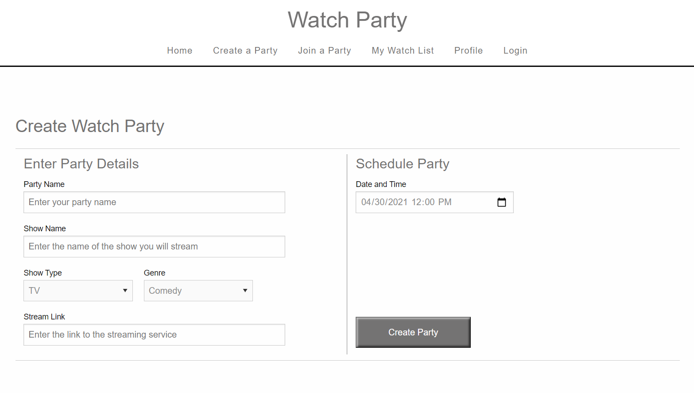
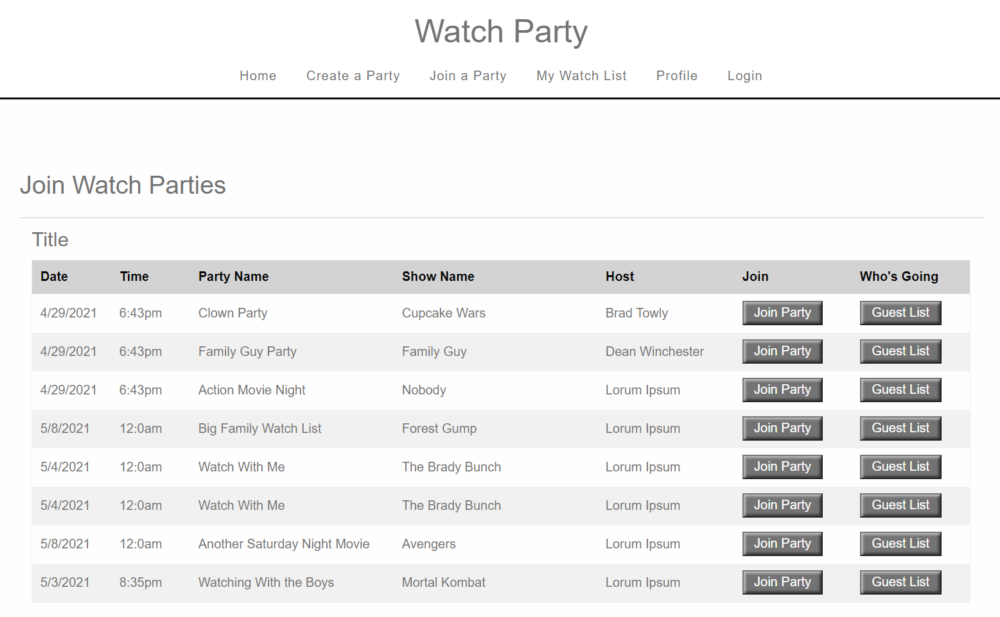

# Watch Party
## 
## Description 
This application allows users to create Watch Parties listing shows, dates, and times 

with streaming links so that friends can join. This allows people to connect and watch

programs together even when they are apart.
## Table of Contents
- [Installation](#installation)
- [Usage](#usage)
- [Screenshot](#screenshot)
- [Screencast](#screencast)
- [License_Details](#license_details)
- [Contributing](#contributing) 
- [Questions](#questions)
## Installation
Run "nmp i" from the command line. The application can also be run from a live link hosted on Heroku. 

:https://watchparties.herokuapp.com/
## Usage
To use the app users create watch parties and invite others to join them. Users can also view other 

watch parties and join them. Users can manage their watch list.
## Screenshot

## Screencast

## License_Details
This project is licensed through: MIT

## Contributing

Daniel Vargas, Andrew Medina, Coleen Stuhlfire

## Questions

If you have questions about the repo, open an issue or contact me at 
cstuhlfire@yahoo.com. You can find this project along with my other work 
at https://github.com/cstuhlfire.

